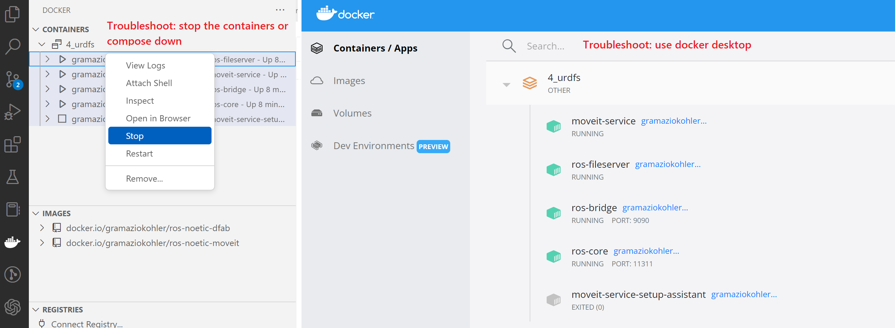
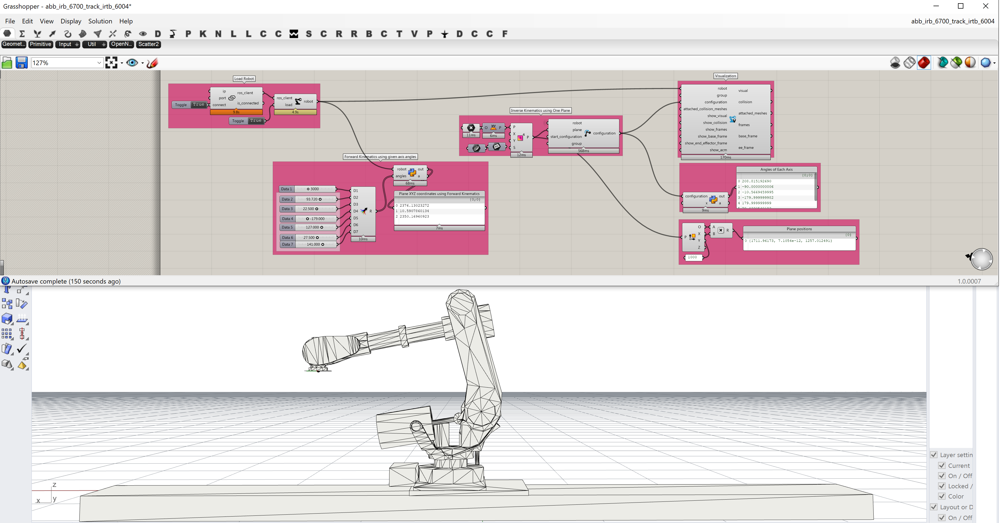

# abb_irb_6700_track_irbt_6004

This is a documentation for the robot ABB IRB 6700 with a track motion IRBT 6004

## Check if Docker is working

Go to folder via Visual Studio Code: **\Robots\robot_files\abb_irb_6700_track_irtb_6004\4_urdfs**

Open file and right click to compose up: **docker-compose.yml**


Troubleshoot: if you have previous docker images running compose them down or use Docker desktop:

After opening the file: **\Robots\robot_files\abb_irb_6700_track_irtb_6004\4_urdfs\abb_irb_6700_track_irtb_6004.gh** , you should see a similar robot configuration:



## Running Robot

Compose up the docker image that has the docker driver added and connect with the enthernet cable - C:\IBOIS57_Code\Software\Robots\robot_files\abb_irb_6700_track_irtb_6004\2_docker\docker-compose.yml

This docker contains the driver service:

```
abb-driver:

    image:compasrrc/compas_rrc_driver:v1.1.2

    container_name:abb-driver

    environment:

    - ROS_HOSTNAME=abb-driver

    - ROS_MASTER_URI=http://ros-master:11311

    depends_on:

    - ros-core

    command:

    - roslaunch

    - --wait

    - compas_rrc_driver

    - bringup.launch

    - robot_ip:=192.168.125.1

    - robot_streaming_port:=30101

    - robot_state_port:=30201

    - namespace:=rob1
```

On teach go to production window

compose down in vscode ->PP to Main in teach pendant

Set up ip address of the pc matching the driver ip of the robot:


## Playgrounds

CTRL+SHIFT+P -> Command Prompt

get_and_move_to_joints.py

get_and_move_to_target.py
