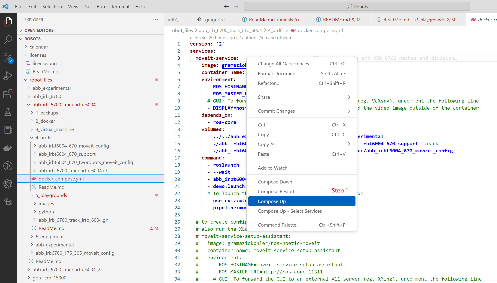

# abb_irb_6700_track_irbt_6004

This is a documentation for the robot ABB IRB 6700 with a track motion IRBT 6004

## Running Robot

Get the 💰 **compas_rrc 💰** using Anaconda prompt: **conda create -c conda-forge -n robots-gis compas_rrc python=3.8**

Connect with the Ethernet cable [💻](https://emojiterra.com/laptop-computer/) -> [🔌](https://emojiterra.com/electric-plug/) -> [🤖](https://emojipedia.org/robot/)

Configure [🌐 ](https://emojipedia.org/globe-with-meridians/)IP address of the pc matching the driver ip of the robot:

In teach pendant [🎮](https://emojipedia.org/video-game/) click top right corner and click production window[🎮](https://emojipedia.org/video-game/) :

In teach pendant [🎮](https://emojipedia.org/video-game/) production window -> click PP to main [🎮](https://emojipedia.org/video-game/)  :

In teach pendant [🎮](https://emojipedia.org/video-game/)  production window -> click PP to main -> click yes [🎮](https://emojipedia.org/video-game/)  :

In teach pendant [🎮](https://emojipedia.org/video-game/)  production window -> click PP to main -> click yes -> hit play button [🎮](https://emojipedia.org/video-game/)  :

In VSCode right click "compose-up", while the docker-compose.yml. Before doing that, be sure that previous docker instances are composed down [💻](https://emojiterra.com/laptop-computer/) use this file: **\Robots\robot_files\abb_irb_6700_track_irtb_6004\2_docker\docker-compose.yml** :

In teach pendant [🎮](https://emojipedia.org/video-game/)  this window must change to the next image [🎮](https://emojipedia.org/video-game/)  :

In teach pendant [🎮](https://emojipedia.org/video-game/)  the new message should look like this, else you are not connected and see only the previous screenshot [🎮](https://emojipedia.org/video-game/)  :

## Playgrounds

Setup the VSCode interface:

* In VSCode user Command Prompt (CTRL+SHIFT+P -> Terminal: Select Default Profile ) [💻](https://emojiterra.com/laptop-computer/)
* In VSCode user Command Prompt (CTRL+SHIFT+P -> Python: Select Interpreter ) [💻](https://emojiterra.com/laptop-computer/)
* Right click on the Python code -> Run Python File in Terminal [💻](https://emojiterra.com/laptop-computer/)

Examples **\Robots\robot_files\abb_irb_6700_track_irtb_6004\5_playgrounds\python**

* get current robot position and move by 100 mm in X-Axis **get_and_move_to_target.py**
* get current robot position and rotate 1st axis by 15 degrees **get_and_move_to_joints.py**

## Check if Docker and URDF is working

Go to folder via Visual Studio Code: **\Robots\robot_files\abb_irb_6700_track_irtb_6004\4_urdfs**

Open file and right click to compose up: **docker-compose.yml**

Troubleshoot: if you have previous docker images running compose them down or use Docker desktop:

After opening the file: **\Robots\robot_files\abb_irb_6700_track_irtb_6004\4_urdfs\abb_irb_6700_track_irtb_6004.gh** , you should see a similar robot configuration:

