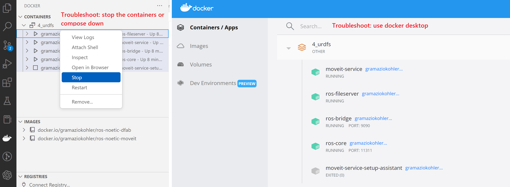
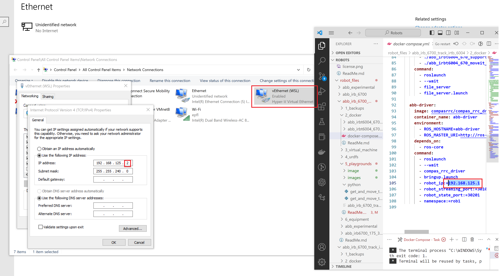
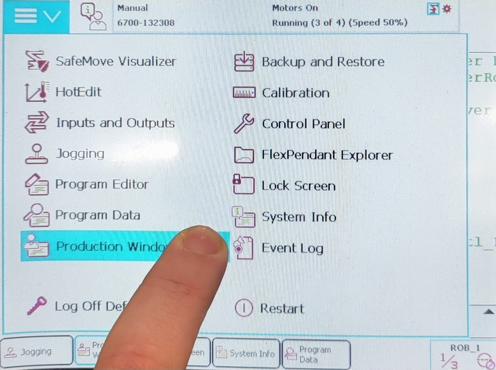
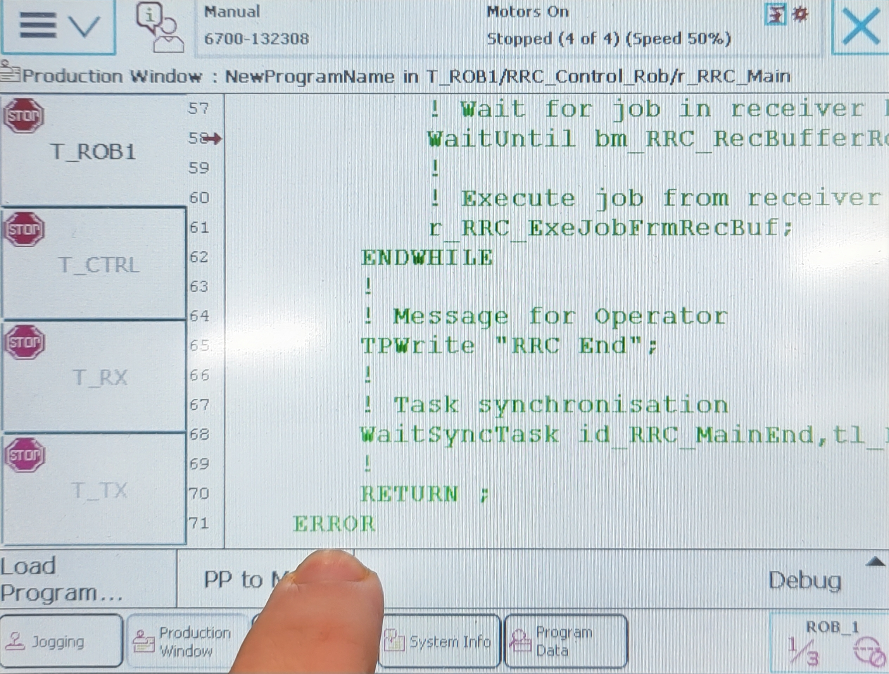
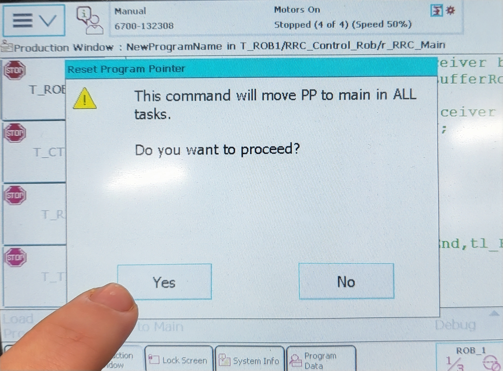
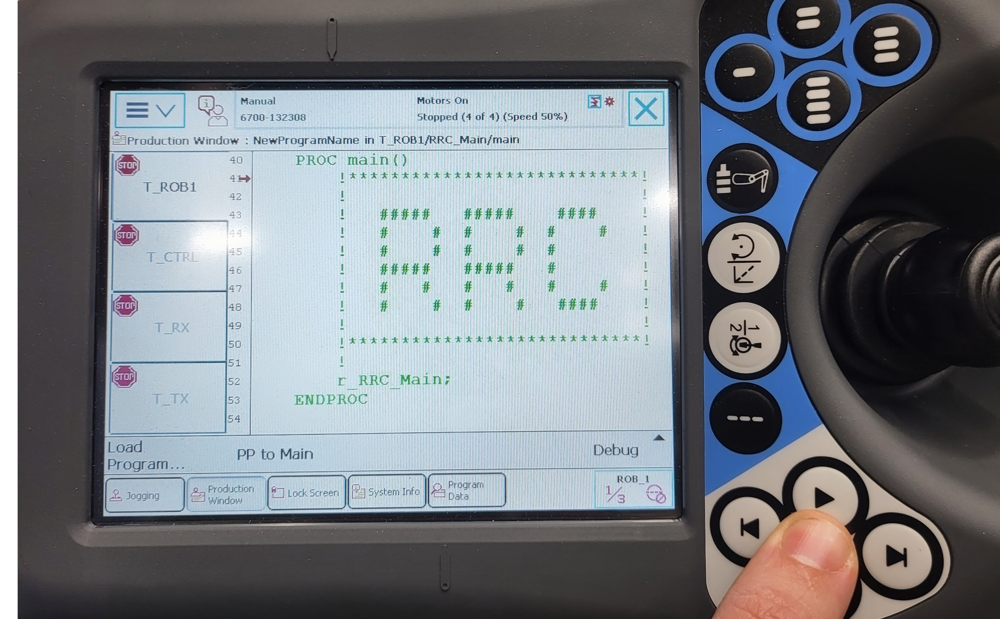
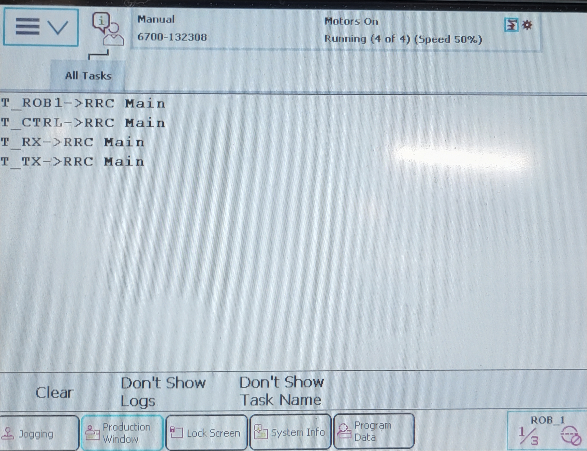
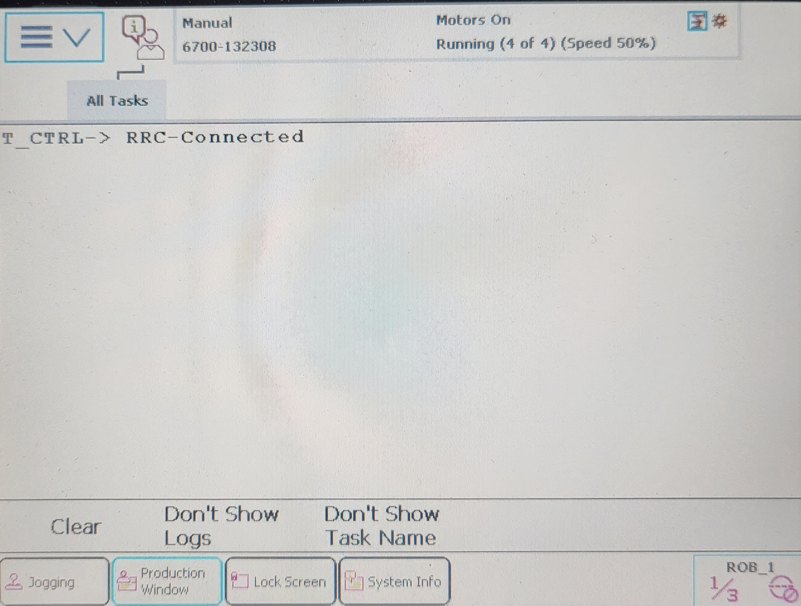
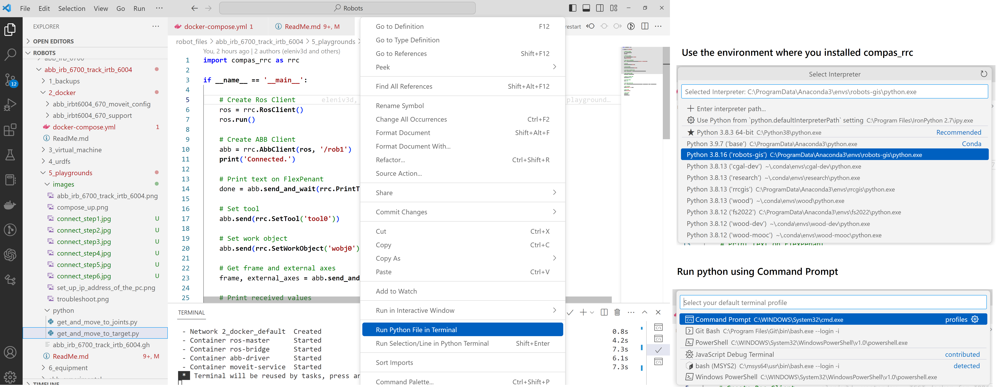

# Software Installation (If you never used Anaconda, VSCode or Git):

Step 0 - Install **Docker** (https://www.docker.com/products/docker-desktop)

Step 1 - Install **Git** (https://git-scm.com/downloads) and clone the robots-gis repository using terminal or unzip it from usb file: 

``` bash
git clone https://github.com/GIS-EPFL/Robots.git
```


Step 2 - Install **Anaconda** (https://www.anaconda.com/products/distribution) and install it, during installation mark the option to add the path to the environment variables:


Step 3 - run the **Anacond Prompt** terminal using Administrative rights

Step 4 - update conda

``` bash
conda config --add channels conda-forge
```

Step 5 - using Anaconda Prompt write a series commands to create an environment:

``` bash
conda create -c conda-forge -n robots-gis compas_rrc python=3.8
```

Step 6 - Install compas packages for rhino:
``` bash
conda install COMPAS
python -m compas_rhino.install -v 7.0
```

Step 6 - install **VSCode** (https://code.visualstudio.com/download)

Step 7 - install **Python** and **Docker** extensions in VScode


Step 8 - change default terminal to “Command Line”, type “Ctrl+Shift+P” and type “Select Default Shell” and select “Command Prompt”


Step 9 - change the environment to “robots-gis”, type “Ctrl+Shift+P” and type “Python: Select Interpreter” and select “wood-dev”. Finally go to tests folder, open any file, right click on the canvas and click “Run Python file in Terminal”


Step 10 - Open the folder of the "Robots" cloned from github on Visual Studio Code:


Step11 - Open Docker for the first time and install WSL if needed:


# abb_irb_6700_track_irbt_6004 - Installation without the robot

* Get the 💰 **compas_rrc 💰** using Anaconda prompt: 

``` bash
conda create -c conda-forge -n robots-gis compas_rrc python=3.8
```

## Check if Docker and URDF is working

* Go to folder via Visual Studio Code: **Robots\robot_files\abb_irb_6700_track_irtb_6004\4_urdfs\**

* Open file and right click to compose up: **docker-compose.yml**


* Troubleshoot: if you have previous docker images running compose them down or use Docker desktop:




## How to move a robot? - Playgrounds

* After opening the file: **\Robots\robot_files\abb_irb_6700_track_irtb_6004\4_urdfs\abb_irb_6700_track_irtb_6004.gh** , you should see a similar robot configuration:


* also try the IK setup constrained with linear axis: **\Robots\robot_files\abb_irb_6700_track_irtb_6004\4_urdfs\abb_irb_6700_rrc_motion_planning.gh**


___
___
___

# abb_irb_6700_track_irbt_6004 - Installation with the robot

This is a documentation for the robot ABB IRB 6700 with a track motion IRBT 6004


## How to connect to Robot - compas_rrc

* Get the 💰 **compas_rrc 💰** using Anaconda prompt: 

``` bash
conda create -c conda-forge -n robots-gis compas_rrc python=3.8
```

* Connect with the Ethernet cable [💻](https://emojiterra.com/laptop-computer/) -> [🔌](https://emojiterra.com/electric-plug/) -> [🤖](https://emojipedia.org/robot/)

* Configure [🌐 ](https://emojipedia.org/globe-with-meridians/)IP address of the pc matching the driver ip of the robot, with a different ending e.g. xxx.xxx.xxx.2 instead of 1:



* In teach pendant [🎮](https://emojipedia.org/video-game/) click top right corner and click production window[🎮](https://emojipedia.org/video-game/) :



* In teach pendant [🎮](https://emojipedia.org/video-game/) production window -> click PP to main [🎮](https://emojipedia.org/video-game/)  :



* In teach pendant [🎮](https://emojipedia.org/video-game/)  production window -> click PP to main -> click yes [🎮](https://emojipedia.org/video-game/)  :



* In teach pendant [🎮](https://emojipedia.org/video-game/)  production window -> click PP to main -> click yes -> hit play button [🎮](https://emojipedia.org/video-game/)  :



* In VSCode right click "compose-up", while the docker-compose.yml. Before doing that, be sure that previous docker instances are composed down [💻](https://emojiterra.com/laptop-computer/) use this file: **\Robots\robot_files\abb_irb_6700_track_irtb_6004\2_docker\docker-compose.yml** :


* In teach pendant [🎮](https://emojipedia.org/video-game/)  this window must change to the next image [🎮](https://emojipedia.org/video-game/)  :



* In teach pendant [🎮](https://emojipedia.org/video-game/)  the new message should look like this, else you are not connected and see only the previous screenshot [🎮](https://emojipedia.org/video-game/)  :



## How to move a robot? - Playgrounds

Setup the VSCode interface:

* In VSCode choose Command Prompt as a default profile (CTRL+SHIFT+P -> Terminal: Select Default Profile ) [💻](https://emojiterra.com/laptop-computer/)
* In VSCode select the correct python environment "robots-gis" (CTRL+SHIFT+P -> Python: Select Interpreter ) [💻](https://emojiterra.com/laptop-computer/)
* Right click on the Python code -> Run Python File in Terminal [💻](https://emojiterra.com/laptop-computer/)



Examples **\Robots\robot_files\abb_irb_6700_track_irtb_6004\5_playgrounds\python**

* get current robot position and move by 100 mm in X-Axis **get_and_move_to_target.py**
* get current robot position and rotate 1st axis by 15 degrees **get_and_move_to_joints.py**

## Check if Docker and URDF is working

* Go to folder via Visual Studio Code: **\Robots\robot_files\abb_irb_6700_track_irtb_6004\4_urdfs**

* Open file and right click to compose up: **docker-compose.yml**


* Troubleshoot: if you have previous docker images running compose them down or use Docker desktop:


* After opening the file: **\Robots\robot_files\abb_irb_6700_track_irtb_6004\4_urdfs\abb_irb_6700_track_irtb_6004.gh** , you should see a similar robot configuration:


