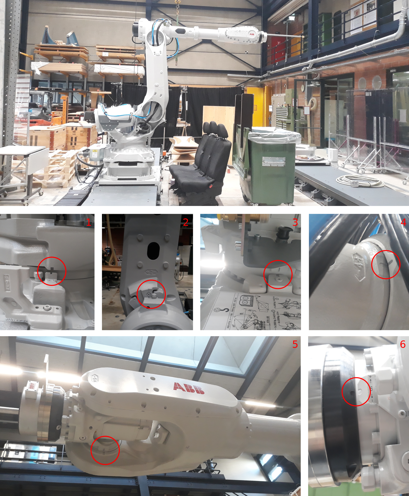
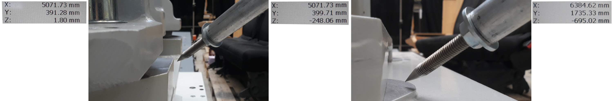

Last updated: 2023_03_17 by Petras Vestartas

# Tutorials

## Software

Follow the instructions below:
- [X] [ABB6700 + Track Connect to the robot and check a basic movement](https://github.com/GIS-EPFL/Robots/tree/main/robot_files/abb_irb_6700_track_irtb_6004)

## Robot Model Technical Specifications

### Axis Alignment and Default Orientation of the Robot

When robots axes are aligned, meaning all angles are set to zero the robot looks like the image below. Moving to this position might be needed when the batteries of the robot are out-of charge. (To-Do: write a procedure of teach-pendant what has to be done to reset the memory of the robot when the batteries are out of charge )

### Heights of the Ground | Rail | Pedestal |

The top of the pedestal is the robot Origin: **0.00 mm**

The top mounting plate of the rail is the pedestal Origin: **-250 mm**

The floor, even if it is not completely flat Origin: **-700 mm**

## Teach Pendant

### Turn On/Off

Switch the handle and plug the ethernet cable to the controller and your pc.
Then you should see on the teach pendant a similar view on the right side:

### Movements: Linear | Axis | Tool

For jogging go to the following menu:

Track has only one direction:

Movement type can be changed between a track and a robot. To switch between the two, follow the process below:

There are two white buttons in the middle right of the teach:
a) the first one allows to change the robot movement between a tool and cartesian linear axis movements
b) and the one below allows to move the robot axis by axis.

### Default Tool - CRCL robot
* t_RRC_Act 

### Create Tool

https://vimeo.com/809136839

### Change Tool

https://vimeo.com/809137342

### Create and Change WorkObject

https://vimeo.com/809137450

### Movements: Speed

https://vimeo.com/809137684

### Movements: Home position

https://vimeo.com/809137558

### IOs

Temp
